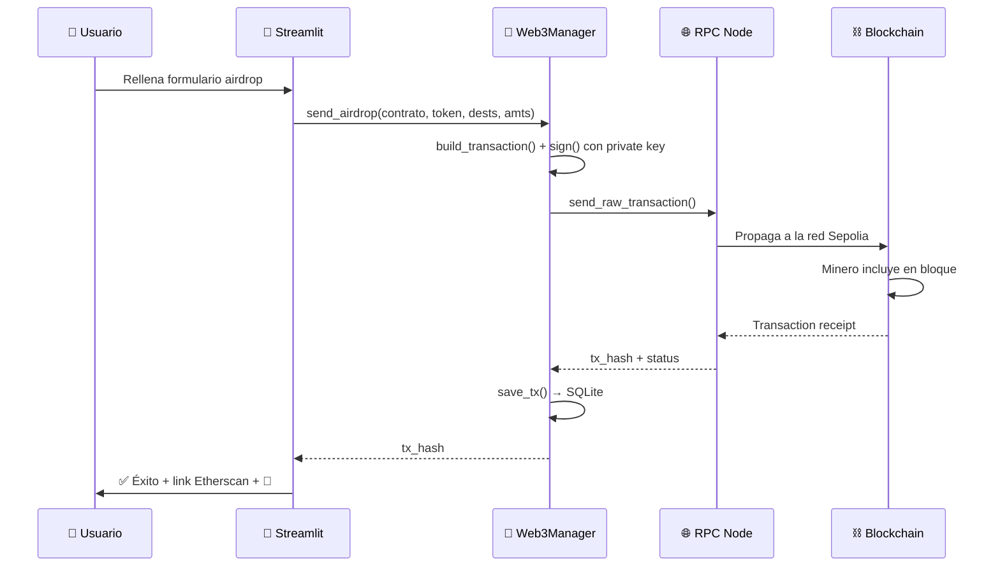

<div align="center">

# 🚀 TSender

### **Web3 Airdrop & Management Console — 100% Python**

*Envía tokens criptográficos a cientos de wallets de una sola vez. Sin Node.js. Sin frontends complejos. Solo Python, Solidity y blockchain.*

---

[](https://www.python.org/)
[](https://docs.soliditylang.org/)
[](https://streamlit.io/)
[](https://sepolia.etherscan.io/)
[](https://web3py.readthedocs.io/)
[](https://opensource.org/licenses/MIT)

[](https://github.com/zzmillann/TsenderPython)
[](https://github.com/zzmillann/TsenderPython/fork)
[](https://github.com/zzmillann/TsenderPython/issues)

---

### 🎓 Trabajo de Fin de Grado · DAW

**Una dApp profesional construida íntegramente en Python que simplifica la gestión de operaciones Web3 sobre la blockchain de Ethereum.**

[🎬 Demo](#-demo) · [📖 Documentación](#-documentación) · [⚡ Quick Start](#-quick-start) · [🛠️ Stack](#%EF%B8%8F-stack-tecnológico) · [👥 Equipo](#-equipo)

</div>

---

## 📑 Tabla de contenidos

- [✨ Características](#-características)
- [🎬 Demo](#-demo)
- [🏗️ Arquitectura](#%EF%B8%8F-arquitectura)
- [🛠️ Stack tecnológico](#%EF%B8%8F-stack-tecnológico)
- [⚡ Quick Start](#-quick-start)
- [🔑 Configuración](#-configuración)
- [📂 Estructura del proyecto](#-estructura-del-proyecto)
- [📜 Smart Contracts](#-smart-contracts)
- [🎯 Funcionalidades](#-funcionalidades)
- [📊 Base de datos](#-base-de-datos)
- [🐛 Logging](#-logging)
- [🚧 Roadmap](#-roadmap)
- [👥 Equipo](#-equipo)
- [📄 Licencia](#-licencia)
- [🙏 Acknowledgments](#-acknowledgments)

---

## ✨ Características

<table>
<tr>
<td width="50%">

### 🎯 Core Features

- 📤 **Airdrop masivo** de tokens ERC-20 a cientos de wallets en **una sola transacción**
- 🪙 **Deploy de Smart Contracts** ERC-20 personalizados con un solo clic
- 💰 **Sistema de donaciones** en ETH con tracking automático de donantes
- 📊 **Dashboard analítico** con gráficos interactivos (Plotly)
- 🔐 **Validación en tiempo real** de direcciones Ethereum
- 📈 **Estimación de gas** antes de cada operación

</td>
<td width="50%">

### 💎 Pro Features

- 🎨 **UI moderna** con diseño glassmorphism y animaciones
- 📥 **Importación CSV** masiva con validación visual
- 📋 **Historial persistente** local con SQLite
- 🪵 **Sistema de logs** profesional multi-handler
- 🔗 **Integración Etherscan** automática
- 📤 **Exportación CSV** de resultados y auditoría
- 🌐 **100% en Python** — sin Node.js, sin npm, sin webpack

</td>
</tr>
</table>

---

## 🎬 Demo

> 🎥 **Demo en vivo:** la app corre en `http://localhost:8501` después del `streamlit run app.py`

### Vista principal — Dashboard

```
┌─────────────────────────────────────────────────────────────┐
│  🚀 TSender Web3 Console               👛 0x742d...35Cc    │
├─────────────────────────────────────────────────────────────┤
│  [Dashboard] [Airdrop] [Deploy] [Historial] [Logs] [Stats] │
├─────────────────────────────────────────────────────────────┤
│                                                              │
│   Gestiona tus envíos on-chain con TSender                  │
│   ──────────────────────────────────────────                │
│                                                              │
│   ┌──────────────┐  ┌──────────────┐  ┌──────────────┐    │
│   │ Wallet       │  │ Balance      │  │ Contract     │    │
│   │ 0x742d...35Cc│  │ 1.2543 ETH   │  │ 0.0500 ETH   │    │
│   └──────────────┘  └──────────────┘  └──────────────┘    │
│                                                              │
│   ┌─── 💰 Donaciones ────┐  ┌─── 👥 Lista donantes ───┐   │
│   │  [Dirección]         │  │  0x1234... (0.05 ETH)   │   │
│   │  [Cantidad ETH]      │  │  0xABCD... (0.10 ETH)   │   │
│   │  [Donar ahora]       │  │  [Cargar lista]         │   │
│   └──────────────────────┘  └──────────────────────────┘   │
└─────────────────────────────────────────────────────────────┘
```

### Flujo de Airdrop

```
Subir CSV ──▶ Validar direcciones ──▶ Estimar gas ──▶ Approve ──▶ Send Airdrop
              (Verde ✅ / Rojo ❌)    (sin gastar gas)            (1 sola TX a 100+ wallets)
```

---

## 🏗️ Arquitectura

TSender está estructurado en **tres capas bien separadas** que se comunican mediante interfaces claras:

```
┌─────────────────────────────────────────────────────────────┐
│  🎨  CAPA 1 — FRONTEND                                       │
│  ─────────────────────                                       │
│  Streamlit + CSS personalizado (glassmorphism)              │
│  6 pestañas: Dashboard · Airdrop · Deploy · Historial ·     │
│  Logs · Estadísticas                                         │
│                                                              │
│  📁 app.py                                                   │
└──────────────────────────┬──────────────────────────────────┘
                           │
                           ▼  (función llamada en cada acción)
┌─────────────────────────────────────────────────────────────┐
│  🐍  CAPA 2 — BACKEND PYTHON                                 │
│  ──────────────────────────                                  │
│  Web3Manager: construcción y firma de transacciones         │
│  SQLite: persistencia del historial                         │
│  Logging: trazabilidad completa                             │
│                                                              │
│  📁 web3_utils.py · db.py · logger_config.py                │
└──────────────────────────┬──────────────────────────────────┘
                           │
                           ▼  (RPC HTTP a un nodo de Ethereum)
┌─────────────────────────────────────────────────────────────┐
│  ⛓️  CAPA 3 — BLOCKCHAIN                                     │
│  ──────────────────────                                      │
│  Smart Contracts en Solidity desplegados en Sepolia         │
│  - CosaToken (ERC-20 personalizado)                         │
│  - Airdrop (reparto masivo + donaciones)                    │
│                                                              │
│  📁 CosaToken.sol · Airdrop.sol                             │
└─────────────────────────────────────────────────────────────┘
```

### Flujo de una transacción típica



---

## 🛠️ Stack tecnológico

<table>
<tr>
<th width="33%">🎨 Frontend</th>
<th width="33%">🐍 Backend</th>
<th width="33%">⛓️ Blockchain</th>
</tr>
<tr>
<td valign="top">

- **Streamlit** `1.40+`
  *UI reactiva en Python puro*
- **Plotly** `5+`
  *Gráficos interactivos*
- **CSS personalizado**
  *Glassmorphism + animaciones*
- **Pandas** `2+`
  *Tablas + CSV*

</td>
<td valign="top">

- **Python** `3.13+`
- **Web3.py** `7.14`
  *Cliente Ethereum*
- **SQLite3** (stdlib)
  *Historial local*
- **py-solc-x** `2.0`
  *Compilador Solidity*
- **logging** (stdlib)
  *Sistema de logs*
- **python-dotenv**
  *Variables de entorno*

</td>
<td valign="top">

- **Solidity** `^0.8.20`
- **Ethereum Sepolia**
  *Red de pruebas*
- **ERC-20 standard**
  *Token fungible*
- **EVM bytecode**
  *Compilado por solcx*
- **OpenZeppelin**
  *(opcional, MiToken.sol)*

</td>
</tr>
</table>

---

## ⚡ Quick Start

### Prerrequisitos

- **Python 3.13+**
- **Git**
- Una wallet con **ETH de Sepolia** ([conseguir aquí](https://sepoliafaucet.com))
- Una clave privada **DE TESTNET** (nunca uses una con fondos reales)

### 1️⃣ Clonar el repositorio

```bash
git clone https://github.com/zzmillann/TsenderPython.git
cd TsenderPython/dapp_python
```

### 2️⃣ Crear entorno virtual

<details>
<summary><b>🪟 Windows (PowerShell)</b></summary>

```powershell
python -m venv venv
.\venv\Scripts\activate
```

</details>

<details>
<summary><b>🐧 Linux / 🍎 macOS</b></summary>

```bash
python3 -m venv venv
source venv/bin/activate
```

</details>

### 3️⃣ Instalar dependencias

```bash
pip install streamlit web3 pandas plotly python-dotenv py-solc-x
```

> 💡 **Tip:** también puedes usar `pip install -r requirements.txt` para instalar todo de golpe.

### 4️⃣ Compilar los Smart Contracts

```bash
python compile_token.py
```

Esto genera `compiled_contracts.json` con el ABI + bytecode de `CosaToken.sol` y `Airdrop.sol`.

### 5️⃣ Configurar variables de entorno

Crea un archivo `.env` en `dapp_python/`:

```env
RPC_URL=https://ethereum-sepolia-rpc.publicnode.com
PRIVATE_KEY=tu_clave_privada_aqui_SIN_0x_al_principio
```

> ⚠️ **NUNCA** subas tu `.env` a Git. Ya está incluido en `.gitignore`.

### 6️⃣ Arrancar la app

```bash
streamlit run app.py
```

Abre tu navegador en **[http://localhost:8501](http://localhost:8501)** y... ¡a disfrutar! 🎉

---

## 🔑 Configuración

### Variables de entorno (`.env`)

| Variable | Descripción | Valor por defecto |
|---|---|---|
| `RPC_URL` | URL del nodo Ethereum (HTTP/HTTPS) | `https://rpc.sepolia.org` |
| `PRIVATE_KEY` | Clave privada de tu wallet | _(obligatoria)_ |

### Configuración de Streamlit (`.streamlit/config.toml`)

```toml
[theme]
primaryColor = "#22d3ee"
backgroundColor = "#0b0f1a"
secondaryBackgroundColor = "#111827"
textColor = "#e2e8f0"
```

### Comprobar conexión

Antes de usar la app, valida tu setup con:

```bash
python check_connection.py
```

Salida esperada:

```
Conectado a https://ethereum-sepolia-rpc.publicnode.com
Dirección: 0x742d35Cc6635C0532925a3b844Bc9e7595f8B5e0
Balance: 1.2543 ETH
Nonce: 42
Gas Price: 1.5 Gwei
```

---

## 📂 Estructura del proyecto

```
TsenderPython/
│
├── 📄 README.md                      # Este archivo
├── 📄 DEFENSA_TFG.md                 # Documento de preparación para defensa
├── 📄 .gitignore                     # Ignora .env, .db, .log, __pycache__
│
└── 📁 dapp_python/                   # ── Todo el código ──
    │
    ├── 📁 .streamlit/
    │   └── config.toml               # Tema oscuro de Streamlit
    │
    ├── 🎨 app.py                     # FRONTEND: interfaz Streamlit (~1500 líneas)
    │                                   ├─ Tab 1: Dashboard
    │                                   ├─ Tab 2: Airdrop (CSV + validación)
    │                                   ├─ Tab 3: Deploy de contratos
    │                                   ├─ Tab 4: Historial (SQLite)
    │                                   ├─ Tab 5: Logs en tiempo real
    │                                   └─ Tab 6: Estadísticas (Plotly)
    │
    ├── 🐍 web3_utils.py              # BACKEND: clase Web3Manager
    │                                   ├─ deploy_contract()
    │                                   ├─ approve_airdrop()
    │                                   ├─ send_airdrop()
    │                                   ├─ estimate_airdrop_gas()
    │                                   ├─ donate_eth() / withdraw_funds()
    │                                   └─ get_token_balance() / get_donors_list()
    │
    ├── 🗄️ db.py                      # BACKEND: persistencia SQLite
    │                                   ├─ init_db()
    │                                   ├─ save_tx()
    │                                   └─ get_history()
    │
    ├── 🪵 logger_config.py           # BACKEND: logging centralizado
    │                                   └─ get_logger(name)
    │
    ├── ⛓️ Airdrop.sol                # SMART CONTRACT: airdrop + donaciones
    │                                   ├─ receive() — entrada de donaciones
    │                                   ├─ airdropTokens(token, dests, amts)
    │                                   ├─ airdropETH(dests, amts) — solo owner
    │                                   ├─ getDonors() / getContractBalance()
    │                                   └─ withdrawFunds() — solo owner
    │
    ├── ⛓️ CosaToken.sol              # SMART CONTRACT: token ERC-20 "COSA"
    │                                   ├─ transfer() / transferFrom()
    │                                   ├─ approve() / allowance()
    │                                   └─ balanceOf()
    │
    ├── ⛓️ MiToken.sol                # SMART CONTRACT alt. (OpenZeppelin)
    │
    ├── 🔧 compile_token.py           # UTIL: compila .sol → compiled_contracts.json
    ├── 🔧 check_connection.py        # UTIL: diagnóstico de conexión RPC
    ├── 📋 INSTRUCCIONES_TFG.txt      # Guía rápida en texto plano
    ├── 📦 requirements.txt           # Dependencias Python (pip freeze)
    │
    └── 🚫 [autogenerados, .gitignored]
        ├── compiled_contracts.json   # Output de compile_token.py
        ├── historial.db              # BD SQLite local
        ├── tsender.log               # Archivo de logs
        ├── .env                      # Secrets (PRIVATE_KEY)
        └── venv/                     # Entorno virtual
```

---

## 📜 Smart Contracts

### 🪙 CosaToken.sol — Token ERC-20

Implementación minimalista del estándar ERC-20 con el ticker **COSA**.

| Función | Tipo | Descripción |
|---|---|---|
| `balanceOf(address)` | `view` | Balance de tokens de una wallet |
| `transfer(to, value)` | `write` | Transfiere tokens a otra wallet |
| `approve(spender, value)` | `write` | Da permiso a otro contrato/wallet para mover tus tokens |
| `allowance(owner, spender)` | `view` | Consulta el permiso concedido |
| `transferFrom(from, to, value)` | `write` | Mueve tokens de otra wallet (requiere approve previo) |

**Detalles:**
- `name = "Cosa Token"` · `symbol = "COSA"` · `decimals = 18`
- `totalSupply = 1.000.000 × 10^18` minteados al deployer
- Eventos `Transfer` y `Approval` emitidos en cada operación

### 📤 Airdrop.sol — Reparto masivo + Donaciones

Contrato que distribuye tokens a múltiples destinatarios en una sola transacción.

| Función | Tipo | Descripción | Permisos |
|---|---|---|---|
| `receive()` | `payable` | Recibe ETH como donación, registra al donante | 🌍 Cualquiera |
| `airdropTokens(token, dests, amts)` | `write` | Reparte tokens ERC-20 a una lista | 🌍 Cualquiera (con approve previo) |
| `airdropETH(dests, amts)` | `write` | Reparte ETH del contrato a una lista | 🔒 Solo `owner` |
| `withdrawFunds()` | `write` | Retira todos los ETH del contrato | 🔒 Solo `owner` |
| `getDonors()` | `view` | Lista completa de direcciones donantes | 🌍 Cualquiera |
| `donationAmount(address)` | `view` | ETH donado por una dirección específica | 🌍 Cualquiera |

### 🔄 Flujo "Approve → Airdrop"

```
1. CosaToken.approve(airdropContract, 10^24)     ← "doy permiso al Airdrop"
   ────────────────────────────────────────
2. Airdrop.airdropTokens(token, dests, amts)     ← Airdrop reparte usando tu permiso
   ↓
   Por cada destinatario internamente:
   ↓
   CosaToken.transferFrom(user, dests[i], amts[i])
```

> 🎯 **Por qué este patrón:** los contratos no pueden mover tokens ajenos sin permiso explícito. `approve` registra una "autorización SEPA" que `transferFrom` consume después.

---

## 🎯 Funcionalidades

### 1️⃣ Dashboard de cuenta

- 💰 Balance ETH de tu wallet en tiempo real
- 🏦 Balance ETH de cualquier contrato (consulta sin gas)
- 💝 Sistema de donaciones con un click
- 👥 Lista de donantes históricos de un contrato

### 2️⃣ Airdrop masivo

- 📥 **Importar CSV** con columnas `address` y `amount`
- ✅ **Validación visual** en tiempo real (filas inválidas en rojo)
- 🔍 **Estimación de gas** antes de ejecutar (no gasta nada)
- 🔐 **Flujo Approve → Send** en dos pasos para máxima seguridad
- 📊 **Exportación CSV** de resultados con `address`, `tx_hash`, `status`

**Ejemplo de CSV soportado:**

```csv
address,amount
0xAb5801a7D398351b8bE11C439e05C5B3259aeC9B,100
0xCA35b7d915458EF540aDe6068dFe2F44E8fa733c,200
0x14723A09ACff6D2A60DcdF7aA4AFf308FDDC160C,150
```

### 3️⃣ Deploy de contratos

- 🪙 **Lanzar Cosa Token** con un click → contrato ERC-20 listo para usar
- ⚡ **Lanzar Airdrop Contract** → infraestructura de reparto
- 🔗 **Link directo a Etherscan** para verificar el deploy

### 4️⃣ Historial persistente

- 📋 Tabla con TODAS las operaciones (Airdrop, Approve, Deploy, Donación)
- 🔍 Filtros por tipo de operación
- 📊 Métricas resumen (total, por categoría)
- 📤 Exportación a CSV
- 🔗 Link a Etherscan por cada transacción

### 5️⃣ Visor de logs

- 🪵 Lectura del archivo `tsender.log` en tiempo real
- 🎚️ Filtrado por nivel (DEBUG, INFO, WARNING, ERROR, CRITICAL)
- 📊 Contadores por nivel
- 📥 Descarga completa del log

### 6️⃣ Dashboard de estadísticas

- 📊 **Bar chart:** transacciones por tipo
- 🍩 **Donut chart:** éxito vs error
- 📈 **Line chart:** actividad temporal por día
- 🎯 **KPIs:** total txs, éxito, error, wallets alcanzadas

---

## 📊 Base de datos

Esquema SQLite (`historial.db`):

```sql
CREATE TABLE transacciones (
    id            INTEGER PRIMARY KEY AUTOINCREMENT,
    fecha         TEXT    NOT NULL,             -- YYYY-MM-DD HH:MM:SS
    tipo          TEXT    NOT NULL,             -- Airdrop|Approve|Deploy Token|Deploy Airdrop|Donación
    tx_hash       TEXT    NOT NULL,             -- Hash de la transacción on-chain
    desde         TEXT,                          -- Wallet que firmó
    contrato      TEXT,                          -- Contrato involucrado
    destinatarios INTEGER,                       -- Solo para Airdrops
    estado        TEXT    NOT NULL DEFAULT 'éxito'
);
```

> 💾 **Persistencia local:** los datos están solo en tu máquina (perfecto para uso individual). Para multi-usuario, migrar a PostgreSQL.

---

## 🐛 Logging

Sistema configurado en `logger_config.py` con **dos handlers**:

| Handler | Destino | Nivel | Para qué |
|---|---|---|---|
| `FileHandler` | `tsender.log` | `DEBUG` | Guarda TODO (debug + info + warn + error) |
| `StreamHandler` | Consola | `INFO` | Solo lo importante en pantalla |

**Formato:**

```
2025-11-13 14:32:15 | INFO     | web3_utils  | Deploy enviado — contrato: CosaToken | hash: 0x...
```

**Ejemplo de uso:**

```python
from logger_config import get_logger

logger = get_logger(__name__)

logger.debug("Detalles internos")
logger.info("Operación completada")
logger.warning("Algo raro pero no crítico")
logger.error("Fallo recuperable")
logger.critical("Error grave")
```

---

## 🚧 Roadmap

### ✅ v1.0 (Actual) — Core MVP

- [x] Deploy de smart contracts desde la interfaz
- [x] Airdrop masivo de tokens ERC-20
- [x] Sistema de donaciones en ETH
- [x] Importación CSV con validación
- [x] Historial persistente en SQLite
- [x] Dashboard de estadísticas con Plotly
- [x] Logging multi-handler
- [x] Estimación de gas previa

### 🔜 v1.1 — Quality of life

- [ ] Soporte para **MetaMask** vía WalletConnect (sin pegar private key)
- [ ] **Multi-chain:** Polygon, Arbitrum, Optimism, BSC
- [ ] **Programación de airdrops:** ejecución diferida
- [ ] **Snapshot de holders:** airdrop automático a poseedores de otro token
- [ ] **Notificaciones por email** al finalizar operaciones largas

### 🔮 v2.0 — Producción

- [ ] Soporte **ERC-721** (NFTs)
- [ ] **Whitelist de wallets** validadas
- [ ] **Multi-sig** para operaciones críticas
- [ ] Migración a **PostgreSQL** para historial compartido
- [ ] **Tests** con `pytest` (backend) + **Foundry** (contratos)
- [ ] **CI/CD** con GitHub Actions
- [ ] **Dockerización** completa
- [ ] **Indexer** con The Graph

---

## 👥 Equipo

<table>
<tr>
<td align="center" width="33%">

### 🎨 Kike
**Frontend Developer**

Diseño UI/UX · Streamlit · CSS Glassmorphism · Layouts

</td>
<td align="center" width="33%">

### 🐍 Marcos
**Backend Developer**

Python · Web3.py · SQLite · Logging · Arquitectura

</td>
<td align="center" width="33%">

### ⛓️ Alejandro
**Blockchain Developer**

Solidity · Smart Contracts · ERC-20 · EVM · Gas optimization

</td>
</tr>
</table>

---

## 📄 Licencia

Este proyecto está licenciado bajo la **MIT License**. Ver [`LICENSE`](LICENSE) para más detalles.

```
MIT License — Copyright (c) 2025 Kike, Marcos & Alejandro
Permission is hereby granted, free of charge, to any person obtaining a copy
of this software and associated documentation files (the "Software")...
```

> ⚠️ **DISCLAIMER:** este software se proporciona con fines **educativos** y de **demostración**.
> No usar con claves privadas con fondos reales en mainnet sin auditorías profesionales.

---

## 🙏 Acknowledgments

Inspirado en proyectos del ecosistema Web3:

- 🚀 [**tsender.app**](https://tsender.app) — concepto original de airdrop masivo
- 📚 [**Patrick Collins / Cyfrin**](https://updraft.cyfrin.io) — cursos de blockchain dev
- 🦊 [**MetaMask**](https://metamask.io) — wallet de referencia
- 🔍 [**Etherscan**](https://etherscan.io) — explorador de Ethereum
- 🌐 [**Sepolia Faucets**](https://sepoliafaucet.com) — ETH gratis para testing

### Librerías clave

- [**Web3.py**](https://github.com/ethereum/web3.py) — cliente Python para Ethereum
- [**Streamlit**](https://github.com/streamlit/streamlit) — framework de UI en Python
- [**py-solc-x**](https://github.com/ApeWorX/py-solc-x) — compilador Solidity desde Python
- [**Plotly**](https://github.com/plotly/plotly.py) — visualización interactiva
- [**Pandas**](https://github.com/pandas-dev/pandas) — manipulación de datos

---

<div align="center">

### ⭐ Si te gusta este proyecto, dale una estrella en GitHub ⭐

[](https://star-history.com/#zzmillann/TsenderPython&Date)

---

**Hecho con ❤️ y mucho ☕ por Kike, Marcos & Alejandro**

*Trabajo de Fin de Grado — DAW · 2025*

[⬆️ Volver arriba](#-tsender)

</div>
